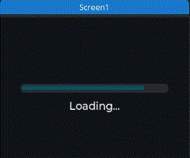
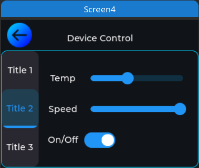
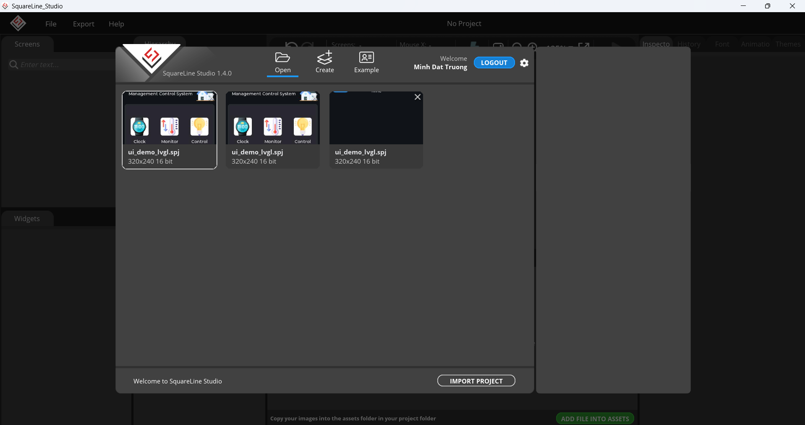
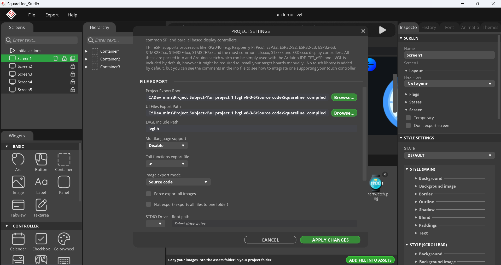
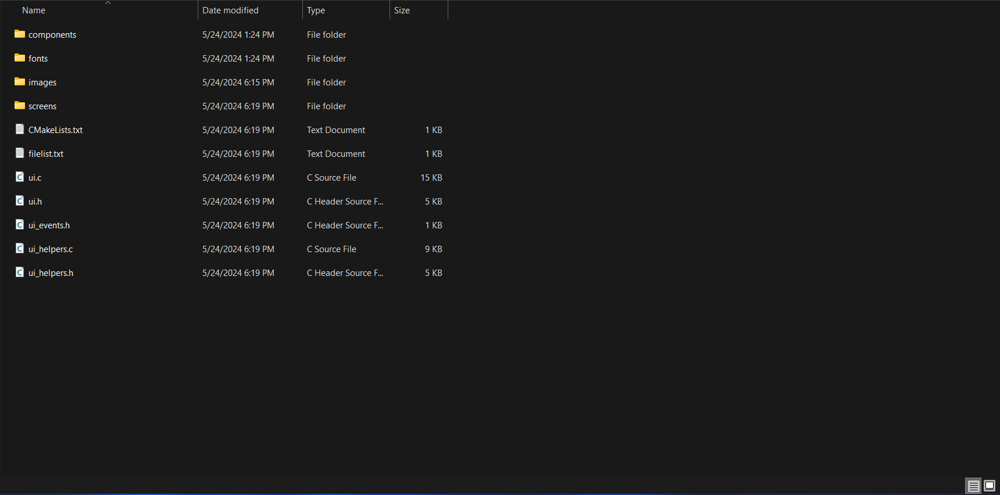

# LVGL-ILI9341-ControlCenter

This project provides resources and examples to build a Control Center using the LVGL library on a TFT display with ILI9341 controller (320x240) and touchscreen capability. The interface is designed for monitoring and controlling devices in both home and factory environments, utilizing UDP communication for efficient interaction.

<p align="center">
    
    
    
</p>

## Features

- Beautiful and user-friendly interface with LVGL on TFT display.
- Monitor and control devices remotely through UDP connection.
- Supports both home and factory environments.

## Setup Guide LVGL

Follow these steps to set up LVGL in your project:

### Get the Library

Start by obtaining the LVGL library from its GitHub repository: [LVGL GitHub Repository](https://github.com/lvgl/lvgl)

You can clone it using Git: git clone https://github.com/lvgl/lvgl.git

Alternatively, download lvgl 8.3.6 version compatible with Squareline 1.4.0 in my this repository [ui_project_1_lvgl_v8-3-6/libraries/lvgl]. It has been calibrated and can be used immediately without Configuration

### Configuration

LVGL provides a configuration header file named `lv_conf.h`. Customize this file to set LVGL's behavior, disable unused modules, adjust buffer sizes, etc.
1. Copy `lv_conf_template.h` from the LVGL directory, rename it to `lv_conf.h`.
2. Change `#if 0` to `#if 1` in `lv_conf.h` to enable its content.
3. Customize the configuration options as needed. Comments in the file explain their meanings.

### Initialization

To use LVGL effectively, follow these initialization steps:
1. Call `lv_init()` to initialize LVGL.
2. Initialize your display and input drivers.
3. Register the display and input device drivers in LVGL.
4. Call `lv_tick_inc(x)` every `x` milliseconds in an interrupt to report elapsed time to LVGL.
5. Call `lv_timer_handler()` every few milliseconds to handle LVGL-related tasks.

## Usage Guide Squareline 1.4.0

1. **Prerequisites**: Make sure you have installed Squareline and have set up the development environment for working with TFT display and LVGL library.

2. **Clone Repository**: Clone this repository to your computer.

    ```
    git clone https://github.com/minzdat/LVGL-ILI9341-ControlCenter.git
    ```

3. **Run Examples**: Open the examples in Squareline. Like as ui_demo_lvgl.spj in folder ui_project_1_lvgl_v8-3-6

<p align="center">
    
</p>

4. **Customize and Develop**: Customize the interface and add new features according to your needs, and contribute to this project if you'd like.

5. **Execute Options**: Choose `File` -> `Project Settings` -> Set FILE EXPORT according to the following reference

<p align="center">
    
</p>

6. **Complete**: Choose `Export` -> `Export UI Files`. Then navigate to the path as set in FILE EXPORT to view the project results

<p align="center">
    
</p>

## Contributions

If you'd like to contribute to this project, please create a pull request and we'll review and integrate your improvements into the project.

---

Thank you for your interest in this project! All contributions and feedback are highly appreciated.
