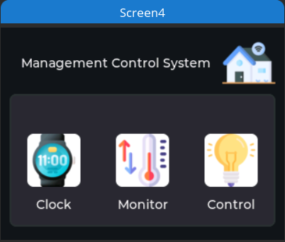

# LVGL-ILI9341-ControlCenter

<p align="center">
  
  
  
</p>

This project provides resources and examples to build a Control Center using the LVGL library on a TFT display with ILI9341 controller (320x240) and touchscreen capability. The interface is designed for monitoring and controlling devices in both home and factory environments, utilizing UDP communication for efficient interaction.

## Features

- Beautiful and user-friendly interface with LVGL on TFT display.
- Monitor and control devices remotely through UDP connection.
- Supports both home and factory environments.

## Usage Guide

1. **Prerequisites**: Make sure you have installed Squareline and have set up the development environment for working with TFT display and LVGL library.

2. **Clone Repository**: Clone this repository to your computer.

    ```
    git clone https://github.com/minzdat/LVGL-ILI9341-ControlCenter.git
    ```

3. **Run Examples**: Open the examples in Squareline and upload them to the TFT display to see the control interface in action.

4. **Customize and Develop**: Customize the interface and add new features according to your needs, and contribute to this project if you'd like.

## Contributions

If you'd like to contribute to this project, please create a pull request and we'll review and integrate your improvements into the project.

---

Thank you for your interest in this project! All contributions and feedback are highly appreciated.
